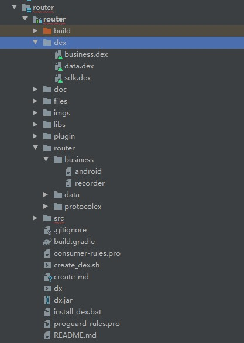

# 读我读我读我

## router是什么？

router 是为了方便车机交互组同事快速开发完成定制项目需求的一套组件化路由方案，整体项目架构设计如下：


这些组件的作用如下：

- platform 平台组件为了适配和兼容不同平台传输协议，例如tcp,udp,mqt等。
- protocol_parser 平台协议组件为了兼容不同地级市平台协议，例如标准905，昆明市905协议等，并且向外提供统一的接口，不会随协议改变而改变接口，不同的地方由此组件完成。
- external_parser 外设协议组件，为了兼容外设协议不同，例如不同厂家计价器、顶灯等。
- data 向外提供数据源，统一接口，屏蔽不同进程调用的差异性。
- business 业务组件，基础业务的沉淀，方便快速定制。
- compatiblesdk 适配不同平台sdk接口的差异性。在保证业务组件代码的不变性，支持多平台运行。
- router 是为不同组件向宿主app提供的接口、数据统一提供组件，各组件不互相引用。


## 特性？

### 可视化接口参数

```shell
./gradlew clean
./gradlew assembleRelease
```

在公司服务器环境下在宿主app的路径下执行此命令，可动态生成各接口路由表，所有接口的md文档，如图所示：


通过路由表可快速了解组件接口的调用方式和入参，返回值等信息。

也可通过安装android studio 插件阅读md文档，如果使用window环境下的Typora软件可方便转为pdf文档阅读：


从文档上，我们可方便的知道应该调用 IRecorder接口的imageRetrive方法就可以完成根据时间范围检索图片文件的业务场景，入参和返回类型也一目了然。

### 动态注入

可以根据文档中需要的接口，利用注解 router自动帮我们注入实例，不需要调用繁杂的接口方法。如下图所示：

```java
@Autowire(path = IRecorder.PATH)
IRecorder recorder;

@Override
protected void onCreate(Bundle savedInstanceState) {
    super.onCreate(savedInstanceState);
    setContentView(R.layout.activity_main);

    //inject 才能动态注入 recorder
    HikRouter.inject(this);
}

/**
     * 测试代码：
     * 直接调用 业务组件 业务场景
     * @param view
     */
public void queryImage(View view){

  if(recorder == null){
    Printer.info(TAG, "recorder is null, inject failed.");
    return ;
  }

  //...填充路由表中需要的参数
  maps.put(RecorderDefine.ImageRetrive.startTime,  startTime);
  maps.put(RecorderDefine.ImageRetrive.endTime, System.currentTimeMillis());
  // invoke.
  recorder.imageRetrive(new JSONObject(maps).toJSONString(), new BaseCalB<FileRetriveModelB>() {

    @Override
    public void response(String result) {
      FileRetriveModelB modelB = JSON.parseObject(result, FileRetriveModelB.class);
      Printer.info(TAG, "model : "+ modelB.toString());
    }
  });
}
```

### 动态加载

由于组件化特性，我们是面对接口编程，我们宿主app中并不需要完成对其他组件的依赖便可完成编译。所以可以在宿主app刚启动的时候动态加载其他组件的代码。

```java
public class ProtocolApp extends RouterApp {

    @Override
    protected void attachBaseContext(Context base) {
        super.attachBaseContext(base);
        try {
            //load plugin dex.
            Log.i("ProtocolApp", "####### START LOAD PLUGIN ##########");
            HikRouter.loadPlugin(this.getClassLoader(), this,
                    HikRouter.PLUGIN_FLAG.DATA_PLUGIN
                            | HikRouter.PLUGIN_FLAG.COMPATIBLE_SDK_PLUGIN
                            | HikRouter.PLUGIN_FLAG.BUSINESS_PROCESSOR_PLUGIN);
        } catch (Exception e) {
            e.printStackTrace();
        }
    }

    @Override
    public void onCreate() {
        super.onCreate();
        Log.i("ProtocolApp", "!!!  HOST APPLICATION ONCREATE !!!");
    }

}
```

这样做的目的是因为，随着项目的越来越多，定制化需求，基础业务的沉淀越来越庞大，依赖这些组件完成编译打包，会影响到app的大小。所以这些组件完成可以通过dx工具生成dex文件，在运行时完成注入。只要在宿主app的工作目录下执行完以下命令即可动态生成dex文件，所有的工作脚本都已经帮我们完成。

```shell
./gradlew clean
./gradlew assembleRelease
```

生成的dex文件路径：



在调试过程中，只要在window环境下双击install_dex.bat，然后重启应用即可完成更新组件，在打包的过程中，需要将dex组件置于系统镜像中，然后应用动态加载。


## 如何使用？

### 初始化router

```java
//初始化router.
HikRouter.initRouter();
```

宿主app在调用此方法后，将会查找各个组件实现类的具体路径，为反射生成实例类做准备。

### 初始化数据库

```java
//创建数据库，需要AndroidManifest.xml中创建 contentprovider 结点
HikRouter.installDb();

//需要在清单文件中注明 DataProvider
<provider
  android:name="com.hikvision.auto.data.DataProvider"
  android:authorities="com.hikvision.auto.dataprovider"
  android:exported="true" />
```

如果想要在此宿主app中创建数据库，并维护数据，调用此方法。需要注意的是，此宿主app必须在清单文件中注明 DataProvider，然后其他任何地方，任何进程想要获取数据均可通过路由表和data组件提供的方法获取。


调用方式：

```java
@Autowire(path = IData.PATH)
private IData DATA;

@Override
public boolean settingPhoneBook(String json) {

try{
    //处理数据
    ContentValues values = new ContentValues();
    values.put(DataDefine.Contact.CONTRACT, peopleName);
    values.put(DataDefine.Contact.FLAG, flag);
    values.put(DataDefine.Contact.PHONE_NUMBER, phoneNumber);
    DATA.insertOrUpdate(Uri.parse("content://com.hikvision.auto.dataprovider/contact"),values,
    DataDefine.Contact.PHONE_NUMBER + " = ?", new String[]{phoneNumber});
    Printer.info(TAG,"Insert new people in contract table." + ", flag : "+ flag + ", peopleName : "
    + peopleName + ", phoneNumber : "+ phoneNumber);

}catch (Exception e){
e.printStackTrace();
return false;
}
return true;
}
```

### 接口调用

根据路由表的接口定义，参考 特性-动态注入 使用。


## 如何拓展？

### 定义接口

```java
/**
 * 行车记录仪相关处理的业务接口
 */
public interface IRecorder {

    /**
     * 生成对应路由表位置，也可根据此路径 HikRouter 自动给接口注入实例
     */
    String PATH = "business/recorder";

    /**
     * 存储图片检索
     * @param json
     * @param cal 图片检索回调
     */
    void imageRetrive(String json, BaseCalB<FileRetriveModelB> cal);

    /**
     * 拍照
     * @param json
     * @param cal
     */
    void takePhoto(String json, BaseCalB<TakePhotoModelB> cal);

    /**
     * 下载文件
     * @param json
     * @param cal
     */
    void downloadFile(String json, BaseCalB<DownLoadModelB> cal);

    /**
     * 司机注册
     * @param json
     */
    void driverRegister(String json, BaseCalB<FaceRegisterModelB> cal);

}
```

每个接口中的json数据表示入参，就是路由表中生成的入参，这里先不管，BaseCalB<T> 是返回的参数，表明此接口处理完之后返回的数据。主要注意的是业务组件会根据返回类型类决定此方法调用是同步调用还是异步调用，如果是void类型的接口方法，业务组件会切换一条单独的线程处理，返回结果通过BaseCalB<T> 来返回数据，如果是非void类型的接口方法，会使用调用线程一直阻塞完成，注意不要出现ANR。

### 定义业务场景

> path: com.hikvision.auto.router.business.recorder.RecorderDefine.java

```java
    @Describe(value = "根据时间范围检索图片文件",
              invoke = "com.hikvision.auto.router.base.business.recorder.IRecorder.imageRetrive",
              path = IRecorder.PATH,
              returnType = "com.hikvision.auto.router.base.business.recorder.model.FileRetriveModelB.class")
    public static class ImageRetrive {
        @TypeDefine(value = "Integer", define = "流水号")
        public static String serial = "serial";  //(int)
        @TypeDefine(value = "Integer", define = "摄像头ID")
        public static String cameraId = "cameraId"; //(int)
        @TypeDefine(value = "Integer", define = "拍照原因")
        public static String reason = "reason"; //(int)
        @TypeDefine(value = "Long", define = "开始时间")
        public static String startTime = "startTime"; //(String)
        @TypeDefine(value = "Long", define = "结束时间")
        public static String endTime = "endTime"; //(String)
    }
```

这是在 RecorderDefine.java 中定义的一种业务场景，意思是想通过调用IRecorder的 imageRetrive方法，完成 “根据时间范围检索图片文件”的操作，下面分别描述注解的作用：

@Describe:

- value 描述业务场景，越详细越好
- path 路由表路径，执行assembleRelease task，会自动在此路径下生成路由表
- invoke 想要执行此业务场景所调用的接口方法
- returnType 返回也是json字符串，可根据fastjson和 returnType 反序列化成对象。

@TypeDefine:

- value 此字段的类型
- define 字段解释
- repeat jsonArray的name


## 作者？

海康汽车电子业务中心\后装事业部\产品开发二部\车载交互开发组\定制开发组

- yanghui11@hikvision.com.cn
- xuzhixiu@hikvision.com.cn
- longtao@hikvision.com.cn